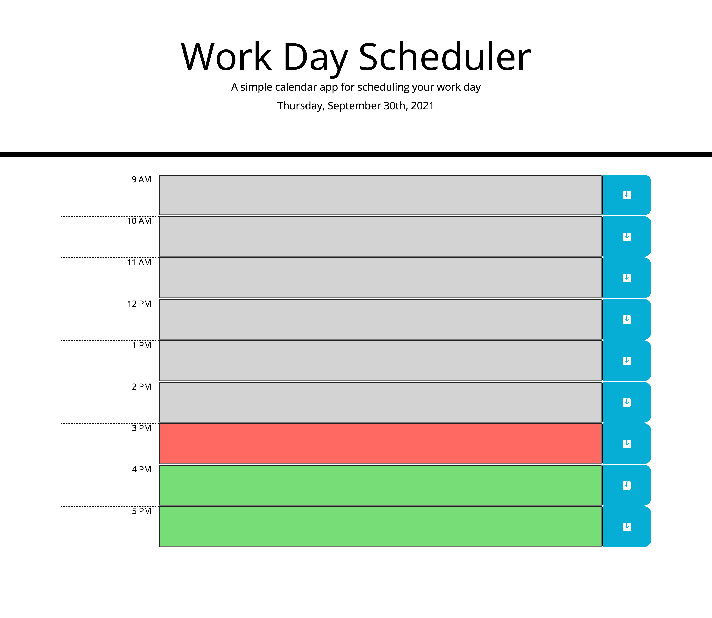

# day-planner

## Description
A simple calendar application that allows a user to save events for each hour of the business day. This app will run in the browser and feature dynimcally updated HTML and CSS powered by jQuery. The Moment.js library is used to display the date and time.

## Credit
Classmate Ethan helped with understanding DOM traversal and how that "might" apply to this assignment!

## Links:
- GitHub Repo:https://github.com/suelee0308/day-planner
- Deployed webpage:https://suelee0308.github.io/day-planner/

## Screenshot:
